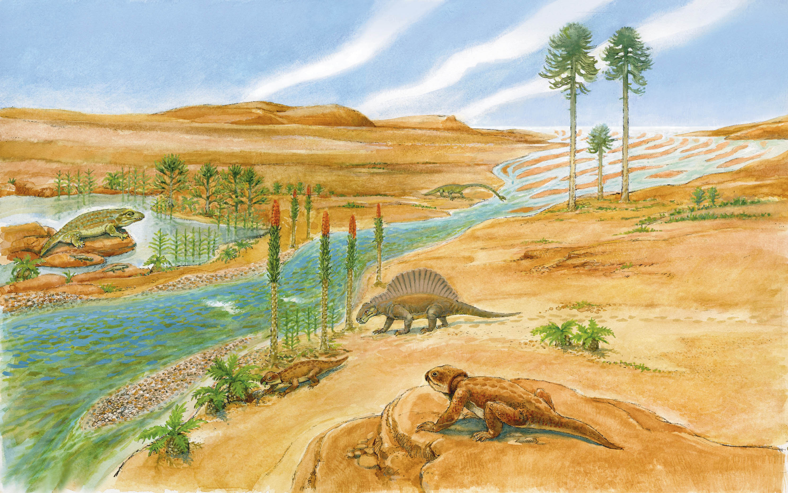

```{r setup, include=FALSE}
knitr::opts_chunk$set(echo = FALSE)
```

# The triassic period #

[click on this link to go at the articles analysed](https://www.livescience.com/43295-triassic-period.html)



# vocabulary #

word from the text         |       definition or synonym         |        translation in french   |
---------------------------|-------------------------------------|--------------------------------|
monsoon                    |          a rainy season             | mousson                        |
---------------------------|-------------------------------------|--------------------------------|
caps                       |          upper limit                | plafond                        |
---------------------------|-------------------------------------|--------------------------------|
seafloor                   |          bottom of the ocean        | fond marins                    |
---------------------------|-------------------------------------|--------------------------------|
rift                       |          a long crack               | fissure                        |
---------------------------|-------------------------------------|--------------------------------|
wiped out                  |          exhausted                  | épuisé                         |
---------------------------|-------------------------------------|--------------------------------|
extant                     |          still in existence         | subsistant                     |
---------------------------|-------------------------------------|--------------------------------|
stony                      |          covered in stone           | pierreux                       |
---------------------------|-------------------------------------|--------------------------------|
shallow                    |          not deep                   | peu profond                    |
---------------------------|-------------------------------------|--------------------------------|
eels                       |          animals,sort of fishes     | anguille                       |
---------------------------|-------------------------------------|--------------------------------|
shape                      |          physical form              | en forme de                    |
---------------------------|-------------------------------------|--------------------------------|
snout                      |          animal's nose              | museau                         |
---------------------------|-------------------------------------|--------------------------------|
tail                       |          end part of an animal      | queue                          |
---------------------------|-------------------------------------|--------------------------------|
fin                        |          webbed part of a fish      | nageoire                       |
---------------------------|-------------------------------------|--------------------------------|
forelimb                   |          animal's front leg         | patte avant                    |
---------------------------|-------------------------------------|--------------------------------|
hindlimb                   |          animal's back leg          | patte arrière                  |
---------------------------|-------------------------------------|--------------------------------|
streamlined                |          form of the body           | fuselé                         |
---------------------------|-------------------------------------|--------------------------------|
genus                      |          biological subdivision     | genre                          |
---------------------------|-------------------------------------|--------------------------------|
recover                    |          regain health              |récuperer                       |
---------------------------|-------------------------------------|--------------------------------|
fern                       |          a type of plants           | fougère                        |
---------------------------|-------------------------------------|--------------------------------|
predate                    |          date back earlier than     | préceder                       |
---------------------------|-------------------------------------|--------------------------------|
jaw                        |          bone of the face           | machoire                       |
---------------------------|-------------------------------------|--------------------------------|
apex                       |          summit                     | sommet                         |
---------------------------|-------------------------------------|--------------------------------|
upright                    |          vertical                   | debout, vertical               |
---------------------------|-------------------------------------|--------------------------------|
stance                     |          posture                    | position                       |
---------------------------|-------------------------------------|--------------------------------|
hip                        |          part of the body           | hanche                         |
---------------------------|-------------------------------------|--------------------------------|
pick up speed              |          get faster                 | prendre de la vitesse          |
---------------------------|-------------------------------------|--------------------------------|
hollow                     |          empty inside               | creux                          |
---------------------------|-------------------------------------|--------------------------------|
sharp                      |          able to cut                | tranchant,aiguiser             |
---------------------------|-------------------------------------|--------------------------------|
clawed                     |          having claws               | griffus                        |
---------------------------|-------------------------------------|--------------------------------|
bony                       |          made of bone               | osseux                         |
---------------------------|-------------------------------------|--------------------------------|
glided                     |          float on wind              | planant                        |
---------------------------|-------------------------------------|--------------------------------|
sprouting                  |          acquire                    | poussant                       |
---------------------------|-------------------------------------|--------------------------------|
ribs                       |          costal bone                | côtes                          |
---------------------------|-------------------------------------|--------------------------------|
therefore                  |          as a consequence           | par conséquent                 |

# analysis table about the study #


 Researcher ?              |     Mary Bagley
 --------------------------|-----------------------------------------------------------------------------------------
 Published in ?            |     /
---------------------------|-----------------------------------------------------------------------------------------
 General Topic             | the triassic period and the animals who lived in this time
 --------------------------|-----------------------------------------------------------------------------------------
 What was examined ?       | this article examines de weather at this time and the geology. It also describe an                                 |  animal of each family of animals; sea animal (Ichtyosauria), plants, insectes, reptiles                            | (Therapsids, Archosaurs), mammals (Eozostrodon).
 --------------------------|-----------------------------------------------------------------------------------------
 Conclusion                | this article talk about each subject but it isn't accurate.
 --------------------------|-----------------------------------------------------------------------------------------
 remaining questions       | /
