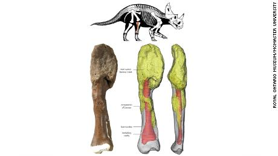

```{r setup, include=FALSE}
knitr::opts_chunk$set(echo = TRUE)
```

[click on this link to go at the articles analysed](https://edition.cnn.com/2020/08/03/americas/dinosaur-fossil-cancer-first-scn/index.html)



# Vocabulary #

word of the text           |        definition or synonym         |       translation in french    |
---------------------------|--------------------------------------|--------------------------------|
lice                       |        parasitic insect              |        pou                     |
---------------------------|--------------------------------------|--------------------------------|
unearthed                  |        dig from the ground           |        exhumer                 |
---------------------------|--------------------------------------|--------------------------------|
unmistakable               |       deep inhalation when tired     |     facilement reconaissable   |
---------------------------|--------------------------------------|--------------------------------|
fibula                     |       calf bone                      |    péronée                     |
---------------------------|--------------------------------------|--------------------------------|


# analysis table about the study #


 Researcher ?              |      Katie Hunt
 --------------------------|-------------------------------------------------------------------------------------------
 Published in ?            |     03/10/2020
---------------------------|-------------------------------------------------------------------------------------------
 General Topic             |     the analyse of a dinosaur's cancer
 --------------------------|-------------------------------------------------------------------------------------------
 What was examined ?       |     how the bone was analysed and what inforamtion it could give to us
 --------------------------|-------------------------------------------------------------------------------------------
 Conclusion                |     the study of  the disease can give us the cancer's evolution with the time.
 --------------------------|-------------------------------------------------------------------------------------------
 remaining questions       |     /
