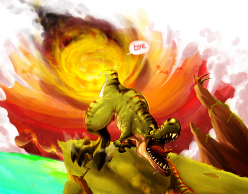

```{r setup, include=FALSE}
knitr::opts_chunk$set(echo = TRUE)
```

There you go ! you have read all the articles, i hope you have enjoy this and now you know all about the mesozoic era. you know the animals what lived at this time, the climate change, the geological change and in general, the process that the earth have done until today.

Well known all of this can help us to find useful information, like the fossil of a dinosaur's cancer what can give us precious information about the evolution in the time of the cancer. There are also informations not very useful but so much interesting. Like the devellopement of the tyranosaurs which before the discover of the embryo, we got no idea about it.

Thanks for reading and i say you bye!

    
